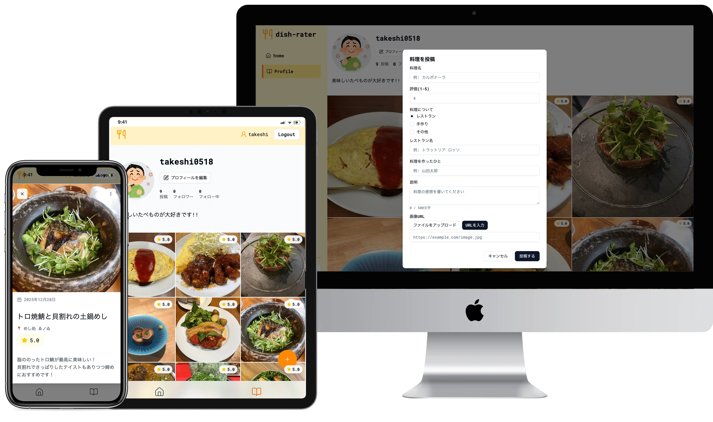

# dish-rater

料理の評価・記録を共有できる Web アプリケーション



## 概要

dish-rater は、レストランや自炊の料理を記録・評価し、他のユーザーと共有できる SNS 風アプリケーションです。

### 主な機能

- 5 段階評価
- 料理の投稿・編集・削除
- ハッシュタグによる分類
- ユーザープロフィール管理
- 料理の検索・フィルター（後日実装予定）

## 技術スタック

### フロントエンド

- **Next.js 16** - App Router
- **TypeScript** - 型安全性
- **Tailwind CSS** - スタイリング
- **shadcn/ui** - UI コンポーネント

### バックエンド

- **Supabase** - 認証・データベース・ストレージ
- **PostgreSQL** - データベース
- **Row Level Security (RLS)** - セキュリティ

### 開発環境

- **Docker** - ローカル開発環境
- **Supabase CLI** - データベース管理

## セットアップ

### 必要な環境

- Node.js 18 以上
- Docker Desktop
- Supabase CLI

### インストール

1. リポジトリをクローン

```bash
$ git clone https://github.com/your-username/dish-rater.git
$ cd dish-rater
```

2. 依存関係をインストール

```bash
$ npm install
```

3. Supabase をセットアップ

```bash
# Supabaseを起動
$ supabase start

# マイグレーションを適用
$ supabase db reset
```

4. 環境変数を設定

`.env.local`ファイルを作成：

```env
NEXT_PUBLIC_SUPABASE_URL=your-supabase-url
NEXT_PUBLIC_SUPABASE_ANON_KEY=your-supabase-anon-key
```

5. 開発サーバーを起動

```bash
$ npm run dev
```

http://localhost:3000 にアクセス

## 使い方

1. **サインアップ** - メールアドレスでアカウント作成
2. **料理を投稿** - 右下の + ボタンから投稿
3. **評価をつける** - 1-5 の星で評価
4. **プロフィール編集** - アバター・自己紹介を設定

## データベース構造

### テーブル

- `profiles` - ユーザープロフィール
- `dishes` - 料理情報

### Storage

- `avatars` - プロフィール画像
- `dishes` - 料理画像

## 開発のこだわり

### セキュリティ

- Row Level Security (RLS) による認可制御
- 必要最小限のデータのみクライアントに送信
- Server Action によるサーバー側処理

### パフォーマンス

- 画像の最適化
- キャッシュ戦略

### 型安全性

- TypeScript による厳密な型定義
- Supabase の型推論を補完

## 今後の予定

- [ ] テスト実装
- [ ] 料理の検索・フィルター機能
- [ ] いいね機能
- [ ] コメント機能
